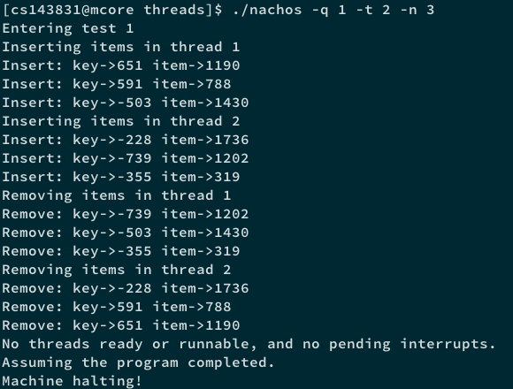
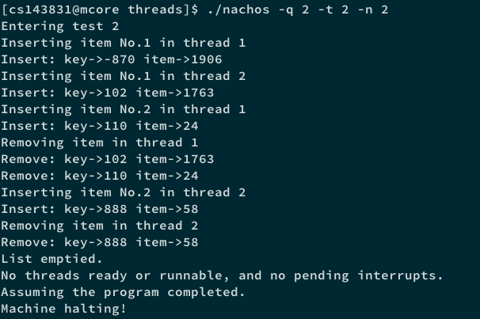
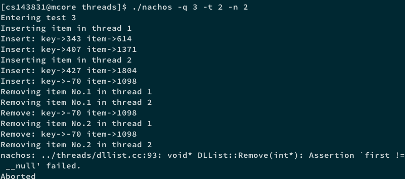
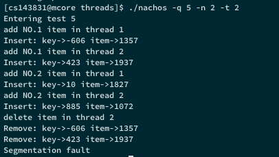
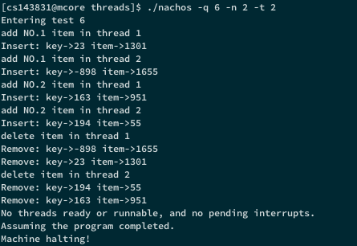

# 操作系统原理课程实验报告

> **实验 1 - 体验 NachOS 下的并发程序设计**
>
> 实验日期：Mar. 2nd - Mar. 25th, 2017

> **小组成员信息**
>
> <del>


### 一、实验内容与要求

本实验目的在于初步熟悉 NachOS 教学用操作系统，体验 NachOS 环境下的并发程序设计。本次实验的具体内容如下：

* 在 Linux 环境下使用 make 工具编译运行原始 NachOS 并阅读相关代码，理解 NachOS 内线程控制、调试功能等部分的具体实现细节；
* 用 C++ 实现双向有序链表 *dllist.h*, *dllist.cc* 与 *dllist-driver.cc*, 其中 *dllist.h* 可参考实验指导中给出的头文件；
* 修改 NachOS 线程系统中的 *threadtest.cc* 及 *main.cc*, 设计可能使并发链表操作发生错误的线程顺序，体验并发程序中可能出现的各种问题。 

### 二、实验设计与代码实现

##### A. *Makefile* 相关修改 

为使 `make` 命令能够正常工作，我们需要向 *Makefile.common* 文件中相关的部分加入我们新增的 *dllist.cc*, *dllist-driver.cc*, *dllist.h* 文件信息与这些文件在编译过程中产生的中间文件信息，从而使得 `make depend` 命令能够正确判断源文件间的依赖关系进而支持 `make` 正常编译链接出目标文件。

*Makefile.common* 中的修改如 **Fig. 1** 中蓝框部分所示：


> ***Fig. 1*** *Makefile.common* 中的部分修改


##### B. 双向链表具体实现 (*dllist.cc* / *dllist.h*)

我们在 *dllist.h* 中定义了双向链表类及链表元素类的具体细节，基本与实验指导中给出的一致，详细内容参见 *dllist.h* 源文件。

根据 *dllist.h* 中的定义，*dllist.cc* 的一例具体实现如下（代码细节参见注释）：

> ***Code. 1***  *dllist.cc* 具体实现

```C++
// initialize a list element
DLLElement::DLLElement(void *itemPtr, int sortKey) {
    key = sortKey;
    item = itemPtr;
    next = prev = NULL;
}

// initialize the list
DLList::DLList() {
    first = last = NULL;
}

// de-allocate the list
DLList::~DLList() {
    DLLElement *now = first;
    DLLElement *next;
    while(now != NULL) {  // from first to last one by one utill NULL
        next = now->next;
        delete now;	 // call delete to get rid of element now
        now = next;
    }
}

// add to tail of list (set key = max_key+1)
void DLList::Append(void *item) {
   if(IsEmpty()) {  // if not empty, add now to the tail
       DLLElement *now = new DLLElement(item, last->key + 1); // call new to allocate element now 
       last->next = now;
       now->prev = last;
       last = now;
   } else {  // if empty, now is both first and last 
       DLLElement *now = new DLLElement(item, 0);
       first = last = now;
   }
}

// add to head of list (set key = min_key-1)
void DLList::Prepend(void *item) {
    if(IsEmpty()) {	 // if not empty, add now to the head
        DLLElement *now = new DLLElement(item, first->key - 1);
        first->prev = now;
        now->next = first;
        first = now;
    } else {  // if empty, now is both first and last 
        DLLElement *now = new DLLElement(item, 0);
        first = last = now;
    }
}

// remove from head of list
// set *keyPtr to key of the removed item
void* DLList::Remove(int *keyPtr) {
    void* thing;
    if(!IsEmpty()) {  // if empty, return NULL
        return NULL;
    } else {  // if not empty
        DLLElement *d = first;  // remove from head of list
        first = first->next;
        if(!first) {  // if empty after removing first element
            first = last = NULL;
        } else {  // if not empty
            first->prev = NULL;
        }
        d->next = NULL;
        if(keyPtr != NULL) {
          *keyPtr = d->key;  // set *keyPtr to key of the removed item
        }
        thing = d->item;
        delete d; // collect garbage
        return thing;  // return item 
    }
}

// return true if list has elements
bool DLList::IsEmpty() {
    return (!first && !last)?false:true;
}

// routines to put/get items on/off list in order (sorted by key)
void DLList::SortedInsert(void *item, int sortKey) {
    DLLElement *newone = new DLLElement(item, sortKey);
    if(!IsEmpty()) {  // if empty
          first = newone;
          last = newone;
    } else { // if not empty
        DLLElement *now= first;
	    // sorted by key
        while(now != NULL) {  
            if(now->key <= sortKey) {
                if(now->next == NULL || now->next->key >= sortKey) {
                   break;
                }
                now = now->next;
            } else {
                now = NULL;
                break;
            }
        }
        if(now == NULL) {
              first->prev = newone;
              newone->next = first;
              first = newone;
        } else {
            if(now == last) {
                last->next = newone;
                newone->prev = last;
                last = newone;
            } else {
                newone->next = now->next;
                newone->next->prev = newone;
                now->next = newone;
                newone->prev = now;
            }
        }
    }
}

// remove first item with key == sortKey
void* DLList::SortedRemove(int sortKey) {
    void* thing;
    if(IsEmpty()) {  // if list is not empty
       DLLElement *now = first;
       while(now != NULL && now->key != sortKey) {  // find out the element with key == sortKey
           now = now->next;
       }
       if(now != NULL) {
          if(now == first) {  // the first is the required one
               first = now->next;
               if(first == NULL) {
                  last = NULL;
               } else {
                   first->prev = NULL;
               }
               now->next = NULL;
          } else if(now == last) {  // the last is the required one
              last = now->prev;
              last->next = NULL;
              now->prev = NULL;
          } else {
             now->prev->next = now->next;
             now->next->prev = now->prev;
          }
          thing = now->item;
          delete now; // collect garbage
          return thing;
       }
    }
    return NULL;  // return NULL if no such item exists
}
```


##### C. *dllist-driver.cc* 具体实现

实验要求 *dllist-driver.cc* 提供两个函数，分别负责向双向链表中随机插入指定个元素／从表头开始删除指定个元素。在我们的实现中，这两个函数分别是 `genItem2List(DLList *list, int n)` 与 `delItemFromList(DLList *list, int n)` 。

其具体实现如下：

>  ***Code. 2***  `genItem2List(DLList *list, int n)` 具体实现

```C++
void genItem2List(DLList *list, int n) {
    int *item, key;
    // generating new rand() seed for each iteration
    static int random = 0;
    random++;
    srand(unsigned(time(0)) + random);
    
    // insert n elements with random *item and key
    for(int i=0;i<n;i++) {
        item = new int;
        *item = rand() % NUM_RANGE;
        key = NUM_RANGE / 2 - rand() % NUM_RANGE;
        cout << "Insert: key->" << key << " item->" << *item << endl;
        // call SortedInsert() to insert elements in order
        list->SortedInsert((void *)item, key);
    }    
}
```


>  ***Code. 3***  `delItemFromList(DLList *list, int n)` 具体实现

```C++
void delItemFromList(DLList *list, int n) {
    void *item;
    int *out = new int; // malloc mem to store the key-value
    for(int i=0;i<n;i++) {
        if(list->IsEmpty()) {
            item = list->Remove(out);
            // print removed elements to console
            if(item != NULL) {
                cout << "Remove: key->"<< *out << " item->" << *(int *)item << endl;
            } else {
                cout << "Remove: key->"<< *out << " item->NULL" << endl;
            }
        } else {
            // return when list had been emptied
            cout << "List emptied." << endl; return;
        }
    }
}
```


##### D. *threadtest.cc* 与 *main.cc* 相关修改

###### *main.cc* 中作出的修改

在 *main.cc* 里我们需要处理命令行调用 `./nachos` 时传入的参数（默认参数可见 *main.cc* 中的注释部分），本次实验中我们主要处理 THREADS 子系统和 *threadtest.cc* 所需要的参数，以方便进行并行链表操作测试。为此，我们定义了以下参数：

| 参数标记 | 对应变量名         | 参数含义             |
| ---- | ------------- | ---------------- |
| -q   | int testnum   | 测例编号，用于进入不同的测试分支 |
| -t   | int threadNum | 需要创建的并行线程数量      |
| -n   | int oprNum    | 链表操作的元素个数        |

+ 不做任何指定时这三个参数为 `testnum = 1, threadNum = oprNum = 2` 。

对应的 *main.cc* 里的修改如 **Fig. 2** 中所示：


> **Fig. 2**  *main.cc* 中修改的部分


###### 并行线程执行顺序设计与 *threadtest.cc* 中的修改

最后一项实验要求需要我们设计在 NachOS 的线程系统下可能使并发链表操作发生错误的线程顺序。

对于并发链表操作可能导致的错误，我们可以将其归结为以下几类：

| 错误类型 | 描述                              | 测例编号    |
| ---- | ------------------------------- | ------- |
| 共享内存 | 并行执行时一个线程可能删除／修改其余线程插入的元素       | ` -q 1` |
| 覆盖   | 并行的线程在链表同一个地方插入元素，导致其中一个被覆盖     | ` -q 2` |
| 非法删除 | 并行的线程准备删除链表中同一个元素，导致段错误         | `-q 3`  |
| 段错误  | 并行的线程一边删除一边插入，导致插入线程出现非法访问      | `-q 4`  |
| 断链   | 并行的线程在同一个地方插入元素，导致元素指针发生不一致     | `-q 5`  |
| 乱序   | 并行的线程在同一个地方插入元素，导致元素位置颠倒，键值大的在前 | `-q 6`  |

NachOS 中线程系统采用 `currentThread->Yield()` 来强制线程发生切换，因此我们可以采用这一函数模拟实际操作系统中可能的切换位置，观察在不同地方发生切换时将引发的以上错误。

为了控制不同线程间的切换位置，我们在 *threadtest.cc* 与 *dllist.cc* 中引入了以下变量来控制切换的发生：

| 变量名          | 含义                           |
| ------------ | ---------------------------- |
| int which    | 变量标识号                        |
| int canYield | 指示当前线程能否 Yield()，控制不同线程的切换位置 |
| int control  | 记录 Yield() 发生次数，控制不同线程的切换位置  |

并行线程采用下面的代码调用 `thread->Fork()` 生成：

```C++
void toDllistTest(VoidFunctionPtr func) { // func points to the specific test
    Thread *t;
    for(int i = 0; i < threadNum; i++) {
        t = new Thread(getName(i + 1));
        t->Fork(func, i + 1); 
    }
}
```

> ***Code. 5*** 并行线程生成


###### 设计的具体执行顺序

下面就 6 种错误类型详细描述我们设计的线程执行顺序，其中 > 表示切换的发生。

**共享内存：**这种情况较为简单，可以描述为线程 A 向链表插入数据  > 线程 B 向链表插入数据 > 线程 A 从链表删除数据 > 线程 B 从链表删除数据。这种情况下两个线程均有可能修改到对方的元素。具体代码实现如下：

> ***Code. 6*** 共享内存测例实现

```C++
void DllistTest1(int which) {
    printf("Inserting items in thread %d\n", which);
    genItem2List(l, oprNum);
    currentThread->Yield(); // Yield here
    printf("Removing items in thread %d\n", which);
    delItemFromList(l, oprNum);
}
```

+ 以下情况的代码实现见 *threadtest.cc* 与 *dllist.cc* 源文件。

**覆盖：**覆盖发生的情况可以描述为线程 A 准备向链表中某一位置插入数据  > 线程 B 准备向链表同一位置插入数据 > 线程 A 完成插入 > 线程 B 完成插入。这种情况下线程 A 的修改被 B 的修改所覆盖。

**非法删除：**类似于覆盖，这种情况可以描述为线程 A 准备删除链表中的数据 P  > 线程 B 准备删除链表中的数据 P  > 线程 A 删除数据 > 线程 B 删除数据。这种情况下线程 B 讲访问到野指针或空指针，发生段错误。

**段错误：**这种情况可以描述为线程 A 调用 `Prepend()` 准备向链表表头插入数据，判断到链表不为空  > 线程 B 从链表删除数据，并将链表删除为空 > 线程 A 向表头插入，并尝试修改 first. 这种情况 first 已经变为 NULL，A 将引发段错误。

**断链：**这种情况可以描述为线程 A 准备向链表中某一位置插入数据 P1 > 线程 B 准备向链表同一位置插入数据 P2 > 线程 A 修改近邻的指针 > 线程 B 修改近邻的指针并完成插入 > 线程 A 修改近邻的指针。这种情况的具体表现较为多样，有可能出现链表中出现环、从表头遍历链表时插入位置访问到 P1 而从表尾遍历时插入位置访问到 P2 等，具体的表现取决于双向链表实现与切换发生的位置，但这都是由于链表指针出现了不一致的情况引起的。

**乱序：**乱序的情况可以描述为有两个数据准备插入，其中 `P1->key` 大于 `P2->key` ，但他们在该链表中应该插入的位置相同。此时线程 A 准备向链表中某一位置插入数据 P1 > 线程 B 准备向链表同一位置插入数据 P2 > 两个线程交叉修改插入位置前后元素与待插入元素的 next 或 prev 指针。这种情况下两线程完成插入时有可能 P1 处在 P2 的前面，造成链表乱序。

### 三、实验结果

##### A. *dllist-driver.cc* 实现结果

为了对 *dllist-driver.cc* 进行测试，我们提供了 `driverTest()` 函数，先调用 `genItem2List()` 向链表内插入指定个随机元素，再调用 `delItemFromList()` 从表头开始删除指定个元素。

使用命令 `./nachos -q 7` 进入 `driverTest()` 的测试分支，其运行结果如 **Fig. n** 所示。


> ***Fig. 3*** `driverTest()` 运行结果

##### B. 链表并发操作运行结果

###### 共享内存情况



> ***Fig. 4*** 共享内存错误运行结果

容易看到线程 1 删除了线程 2 插入的元素，线程 2 也删除了线程 1 插入的元素。

###### 覆盖情况



> ***Fig. 5*** 覆盖错误运行结果

易见可以线程 1 插入的键值为 -870 的元素被覆盖。

###### 非法删除情况



> ***Fig. 6*** 非法删除错误运行结果

易见线程 1 与线程 2 执行了重复的删除。 

###### 段错误情况


> ***Fig. 7*** 共享内存错误运行结果

可以看到插入元素一个线程在链表为空时以链表非空的状态插入，即在 first 为 NULL 时试图改写 `first->next`，这将引发段错误。

###### 断链情况



> ***Fig. 8*** 断链错误运行结果

可以看到断链导致键值为 10 的元素没能被删除且在删除时引发了段错误。

###### 乱序情况



> ***Fig. 9*** 乱序错误运行结果

可以看到键值为 194 的元素先于键值为 163 的元素被删除，并行线程导致了乱序。

### 四、实验中遇到的问题

> 如何判断小组成员各自的双向链表 *dllist.cc* 实现的正确性？

经小组讨论，小组成员均提供了针对 *dllist.cc* 实现的多种测试样例，然后对各自的实现进行单元测试，以通过所有测例的作为实验提交的代码。

>  在发生段错误等难以溯源的错误时，如何快速确定具体的错误发生的地方，有效地进行 Debug？

根据 NachOS 对内置 Debug 系统部分的描述，我们在需要跟踪的地方使用 `DEBUG()` 函数，然后在命令行中执行时使用  `-d`  参数打印 Debug 信息，同时使用 `assert()` 进行断言判断。 

> 如何将多种并行错误执行顺序整合到一组源代码实现中，并方便地指定测试的参数并在不同测例间切换？ 

在 *threadtest.cc* 中我们引入了 testnum 变量进行判断，并且修改了 *main.cc* 传入测试所需的参数。

> 如何控制不同测试情况下不同线程各自的执行顺序？

为了控制不同线程各自的执行顺序，我们设置了 canYield 与 control 变量来控制切换发生的时间，并用 which 变量区别不同进程，使其按照既定的方案进行切换，并用类似于信号量的想法在完成切换前指定另外的线程如何处理该切换。但目前我们粗略地使用了 which 取模进行处理，只能保证控制 2 个线程下的线程行为，实验在多个线程下依然会出现无法区分不同线程的情况。

在实现了 NachOS 的线程控制系统与信号量等部分后这些问题可以得到改进。

### 五、实验收获与总结

在本次实验中，我们对 NachOS 的整体状况有了初步了解，同时探究了NachOS 线程子系统、调试功能等部分的具体实现细节，通过 NachOS 操作系统的代码实现加深了对一个简单的操作系统全貌的直观感受，也更为深入地理解了操作系统中的线程与线程控制概念。通过对并行线程的执行顺序的设计，我们也更为细致的了解到了多线程环境下的并发概念、线程调度与潜在存在的问题，理解了多线程环境下对线程进行合理控制与确保“临界区”的互斥等问题的重要性，在实验的过程中，我们也对 Makefile 的具体规则有了基本的了解，整个不大不小的实验也是回顾快要忘掉的 C++ 的过程，为之后的实验做好了相应准备。

总体说来，实验 1 在组员的互相讨论交流中较为顺利地得以完成。为了合理分工、提高效率小组成员也使用了 Git/GitHub 等工具进行代码管理，学习了基础的单元测试方法。但回顾实验过程，仍然存在有时间安排不合理、分工不明确的地方。在完成第一次实验，更加熟悉操作系统实验的流程与套路后随着组员之间各自工作习惯的相互磨合与相互交流，相信在之后的实验中我们会有更为良好的配合与产出：）

-----