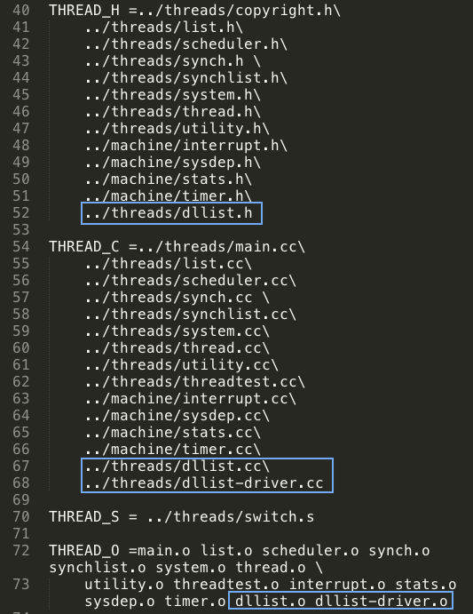
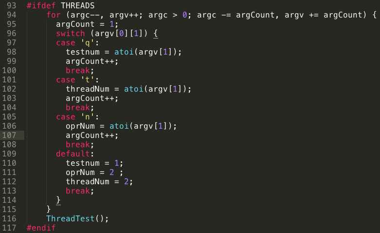
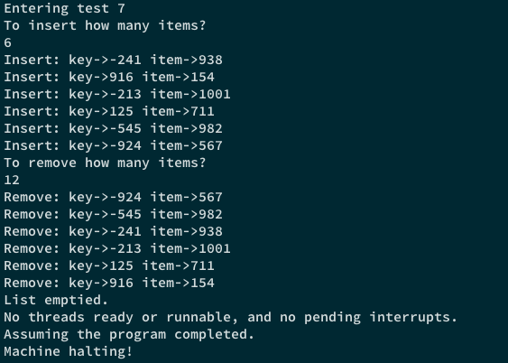

# 操作系统原理课程实验报告

> **实验 1 - 体验 NachOS 下的并发程序设计**
>
> 实验日期：Mar. 2nd - Mar. 25th, 2017

> **小组成员信息**
>
> ==


### 一、实验内容与要求

本实验目的在于初步熟悉 NachOS 教学用操作系统，体验 NachOS 环境下的并发程序设计。本次实验的具体内容如下：

* 在 Linux 环境下使用 make 工具编译运行原始 NachOS 并阅读相关代码，理解 NachOS 内线程控制、调试功能等部分的具体实现细节；
* 用 C++ 实现双向有序链表 *dllist.h*, *dllist.cc* 与 *dllist-driver.cc*, 其中 *dllist.h* 可参考实验指导中给出的头文件；
* 修改 NachOS 线程系统中的 *threadtest.cc* 及 *main.cc*, 设计可能使并发链表操作发生错误的线程顺序，体验并发程序中可能出现的各种问题。 

### 二、实验设计与代码实现

##### A. *Makefile* 相关修改 

为使 `make` 命令能够正常工作，我们需要向 *Makefile.common* 文件中相关的部分加入我们新增的 *dllist.cc*, *dllist-driver.cc*, *dllist.h* 文件信息与这些文件在编译过程中产生的中间文件信息，从而使得 `make depend` 命令能够正确判断源文件间的依赖关系进而支持 `make` 正常编译链接出目标文件。

*Makefile.common* 中的修改如 **Fig. 1** 中蓝框部分所示：



> ***Fig. 1*** *Makefile.common* 中的部分修改

##### B. 双向链表具体实现 (*dllist.cc* / *dllist.h*)

我们在 *dllist.h* 中定义了双向链表类及链表元素类的具体细节，基本与实验指导中给出的一致，详细内容参见 *dllist.h* 源文件。

==!!!FIX ME!!!==

##### C. *dllist-driver.cc* 具体实现

实验要求 *dllist-driver.cc* 提供两个函数，分别负责向双向链表中随机插入指定个元素／从表头开始删除指定个元素。在我们的实现中，这两个函数分别是 `genItem2List(DLList *list, int n)` 与 `delItemFromList(DLList *list, int n)` 。

其具体实现如下：

>  ***Code .1***  `genItem2List(DLList *list, int n)` 具体实现

```C++
void genItem2List(DLList *list, int n)
{
    int *item, key;
  
    // generating new rand() seed for each iteration
    static int random = 0;
    random++;
    srand(unsigned(time(0)) + random);
    
    // insert n elements with random *item and key
    for(int i=0;i<n;i++) {
        item = new int;
        *item = rand() % NUM_RANGE;
        key = NUM_RANGE / 2 - rand() % NUM_RANGE;
        cout << "Insert: key->" << key << " item->" << *item << endl;
        // call SortedInsert() to insert elements in order
        list->SortedInsert((void *)item, key);
    }    
}
```


>  ***Code .2***  `delItemFromList(DLList *list, int n)` 具体实现

```C++
void delItemFromList(DLList *list, int n)
{
    void *item;
    int *out = new int; // malloc mem to store the key-value

    for(int i=0;i<n;i++) {
        if(list->IsEmpty()) {
            item = list->Remove(out);
            // print removed elements to console
            if(item != NULL) {
                cout << "Remove: key->"<< *out << " item->" << *(int *)item << endl;
            } else {
                cout << "Remove: key->"<< *out << " item->NULL" << endl ;
            }
        } else {
            // return when list had been emptied
            cout << "List emptied." << endl;
            return;
        }
    }
}
```

##### D. *threadtest.cc* 与 *main.cc* 相关修改

在 *main.cc* 里我们需要处理命令行调用 `./nachos` 时传入的参数（默认参数可见 *main.cc* 中的注释部分），本次实验中我们主要处理 THREADS 子系统和 *threadtest.cc* 所需要的参数，以方便进行并行链表操作测试。为此，我们定义了以下参数：

| 参数标记 | 对应变量名     | 参数含义             |
| ---- | --------- | ---------------- |
| -q   | testnum   | 测例编号，用于进入不同的测试分支 |
| -t   | threadNum | 需要创建的并行线程数量      |
| -n   | oprNum    | 链表操作的元素个数        |

+ 默认情况下这三个参数为 `testnum = 1, threadNum = oprNum = 2` 。

对应的 *main.cc* 里的修改如 **Fig. n** 中所示：



> **Fig. n**  *main.cc* 中修改的部分

==!!!FIX ME!!!==

### 三、实验结果讨论

##### A. *dllist-driver.cc* 实现结果

为了对 *dllist-driver.cc* 进行测试，我们提供了 `driverTest()` 函数，先调用 `genItem2List()` 向链表内插入指定个随机元素，再调用 `delItemFromList()` 从表头开始删除指定个元素。

使用命令 `./nachos -q 7` 进入 `driverTest()` 的测试分支，其运行结果如 **Fig. n** 所示。



> ***Fig. n*** `driverTest()` 运行结果

##### B. 链表并发操作中可能出现的问题

最后一项实验要求需要我们设计在 NachOS 的线程系统下可能使并发链表操作发生错误的线程顺序。

对于并发链表操作可能导致的错误，我们可以将其归结为以下几类：

| 错误类型 | 描述                            | 测例对应的命令                   |
| ---- | ----------------------------- | ------------------------- |
| 共享内存 | 并行执行时一个线程可能删除／修改其余线程插入的元素     | `./nachos -q 1 -t 2 -n 2` |
| 覆盖   | 并行的线程在链表同一个地方插入元素，导致其中一个被覆盖   | `./nachos -q 2 -t 2 -n 2` |
| 非法删除 | 并行的线程准备删除链表中同一个元素，导致段错误       | `./nachos -q 3 -t 2 -n 2` |
| 断链   | 并行的线程在链表同一个地方插入元素，导致元素指针发生不一致 |                           |
| 乱序插入 |                               |                           |


### 四、实验中遇到的问题

==!!!FIX ME!!!==

### 五、实验收获与总结

==!!!FIX ME!!!==