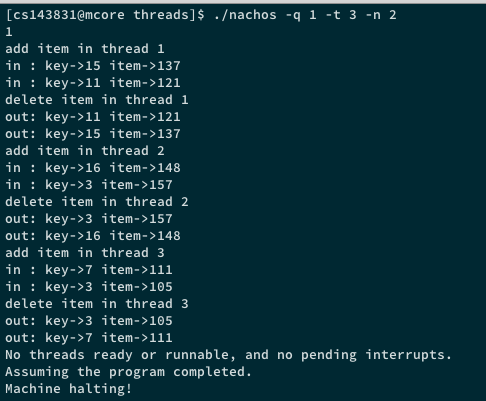
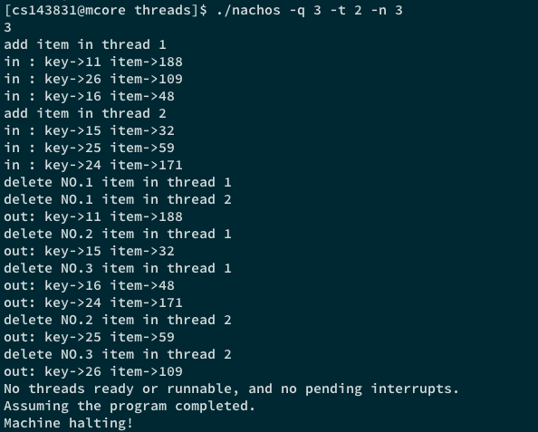
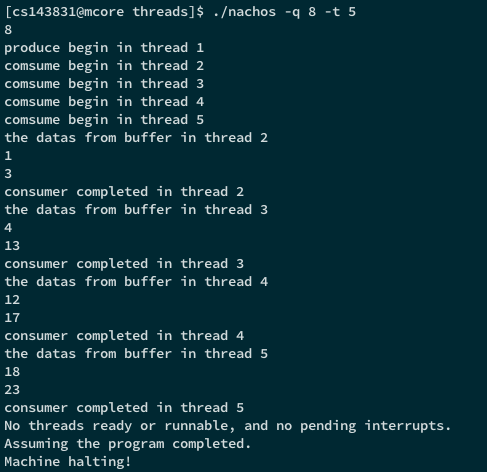

# 操作系统原理课程实验报告

> **实验 2 - 线程与同步**
>
> 实验日期：Mar. 27th - Apr. 21st, 2017

> **小组成员信息**
>
> ==OMIT==

<br/>

### 一、实验内容与要求

本实验目的在于补充 NachOS 下的锁机制与条件变量的相关实现，并利用此类同步机制将上一个实验中的双向有序链表类修改为线程安全的，同时实现一个线程安全的 `Table` 结构（定义见头文件 *Table.h*）与一个有限大小的缓冲区（定义见头文件 *BoundedBuffer.h*）。

本次实验的具体内容如下：

* 分别使用 `Thread::Sleep` 与 `Semaphore` 机制实现锁机制与条件变量，并利用这些同步机制将上一实验中的双向有序链表类修改为线程安全的，并分别对两种实现进行测试。需要注意的是条件变量需要采用 Mesa 语义而非 Hoare 语义；
* 使用同步机制实现一个线程安全的 `Table` 结构；
* 使用同步机制实现一个线程安全的大小受限缓冲区。

### 二、实验设计与代码实现

##### A. 采用 `Thread::Sleep` 实现的锁机制与条件变量 

对于 Lock 类，我们采用如下的头文件定义：

```C++
class Lock {
  public:
    Lock(char* debugName);
    ~Lock();
    char* getName() { return name; }
    bool isHeldByCurrentThread();
    void Acquire();
    void Release(); 
  
  private:
    char* name;
    bool value;
    List* queue;
    Thread* currentHeldLockThread;
};
```

> ***Code. 1*** Lock 类的头文件定义

对于锁而言，其主要方法只有 `Acquire()` 与 `Release()` 这两个方法，线程通过 `Acquire()` 获取对应的互斥锁，通过 `Release()` 释放自己所持有的锁。`isHeldByCurrentThread()` 与 `currentHeldLockThread`  变量用于检查锁是否被当前线程所持有，便于检查类似于一个线程持有的锁被其他线程释放的错误情况。`queue` 用于保存在该锁上阻塞的线程。

Lock 类主要方法的具体实现如下：

```C++
void Lock::Acquire()
{   
    IntStatus oldLevel = interrupt->SetLevel(IntOff);  // close interrupts
    while (value == false) { 
        queue->Append((void *)currentThread);   // go to sleep while lock is occupied
        currentThread->Sleep();
    }
    value = false;
    currentHeldLockThread = currentThread; 
    (void) interrupt->SetLevel(oldLevel);   // re-enable interrupts
}

void Lock::Release()
{
    Thread *thread;
    IntStatus oldLevel = interrupt->SetLevel(IntOff);
    // if queue is not empty release all blocked one
    if (!queue->IsEmpty()) {//wake up one thread
        thread = (Thread *)queue->Remove();
        if (thread != NULL) {   // make thread ready
            scheduler->ReadyToRun(thread);
        }
    }
    value = true; // release the lock
    (void) interrupt->SetLevel(oldLevel);
}

bool Lock::isHeldByCurrentThread()
{
    return (currentThread == currentHeldLockThread);
}
```

> ***Code. 2*** Lock 类的主要实现

值得注意的是，在 Lock 类中需要在合理的时间开/关中断（本实验中为关中断/恢复原中断状态）来保证相关操作的原子性，避免锁的相关操作被切换导致异常。

对于 Condition 类，我们采用如下的头文件定义：

```C++
class Condition {
  public:
    Condition(char* debugName);
    ~Condition();
    char* getName() { return (name); }
    
    void Wait(Lock *conditionLock);
    void Signal(Lock *conditionLock);
    void Broadcast(Lock *conditionLock);

  private:
    char* name;
    List* queue;
};
```

> ***Code. 3*** Condition 类的头文件定义

本实验中的条件变量遵循 Mesa 语义，即提供 `Wait()` , `Signal()` 与 `Broadcast()` 三个方法，且 `Signal()` 方法的原语采用 *cnotify* 原语而非 *csignal* 原语。调用 `Wait()` 的线程将进入阻塞队列直到被唤醒；调用 `Signal()` 的线程将把一个阻塞队列中的线程放入就绪队列，自身继续执行；调用  `Broadcast()` 的线程将把所有阻塞队列中的线程放入就绪队列，自身继续执行。需要注意的是在这些方法中在必要的位置仍然需要通过控制中断来保证操作的原子性。

Condition 类主要方法的具体实现如下：

```C++
void Condition::Wait(Lock* conditionLock)
{ 
    assert(conditionLock->isHeldByCurrentThread());
    // still need off the interupt
    queue->Append((void *)currentThread);
    IntStatus oldLevel = interrupt->SetLevel(IntOff);
    conditionLock->Release();
    currentThread->Sleep();
    (void) interrupt->SetLevel(oldLevel);
    conditionLock->Acquire(); 
}

void Condition::Signal(Lock* conditionLock)
{
    Thread *thread;
    assert(conditionLock->isHeldByCurrentThread());
    if(!queue->IsEmpty()){
        thread = (Thread *)queue->Remove();
        if (thread != NULL)    // make thread ready
            scheduler->ReadyToRun(thread);
    }
}

void Condition::Broadcast(Lock* conditionLock)
{
    Thread *thread;
    assert(conditionLock->isHeldByCurrentThread());
    // wake up all the thread
    while(!queue->IsEmpty()){
        thread = (Thread *)queue->Remove();
        if (thread != NULL)    // make thread ready
            scheduler->ReadyToRun(thread);
    }
}
```

> ***Code. 4*** Condition 类的主要实现

##### B. 采用 `Semaphore` 实现的锁机制与条件变量

在这一部分，我们将采用 `Semaphore` 信号量机制替换上一部分中的 `Thread::Sleep` 原语来实现锁机制与条件变量。

对于 Semaphore 类，我们采用如下的头文件定义：

```C++
class Semaphore {
  public:
    Semaphore(char* debugName, int initialValue);
    ~Semaphore();
    char* getName() { return name;}
    
    void P();
    void V();
    
  private:
    char* name;
    int value;
    List *queue;
};
```

> ***Code. 5*** Semaphore 类的头文件定义

对于信号量而言，其主要方法只有 `P()` 与 `V()` 两者。`P()` 等待信号值大于 0 并减少信号值；`V()` 则将信号值加 1 ，可能唤醒一个阻塞在该信号量上的线程。

```C++
void
Semaphore::P()
{
    IntStatus oldLevel = interrupt->SetLevel(IntOff);// disable interrupts
    
    while (value == 0) { 			// semaphore not available
	queue->Append((void *)currentThread);	// so go to sleep
	currentThread->Sleep();
    } 
    value--;
    (void) interrupt->SetLevel(oldLevel);	// re-enable interrupts
}

void
Semaphore::V()
{
    Thread *thread;
    IntStatus oldLevel = interrupt->SetLevel(IntOff);

    thread = (Thread *)queue->Remove();
    if (thread != NULL) {// make thread ready, consuming the V immediately
        scheduler->ReadyToRun(thread);
    }
    value++;
    (void) interrupt->SetLevel(oldLevel);
}
```

> ***Code. 6*** Semaphore 类的主要实现

对于采用 `Semaphore` 实现的锁与条件变量，其定义与主要实现如下：

```C++
class Lock {
  public:
    Lock(char* debugName);
    ~Lock();
    char* getName() { return name; }

    void Acquire();
    void Release();
    bool isHeldByCurrentThread();
  
  private:
    char *name;
    Semaphore *sem;
    Thread * currentHeldLockThread;
};

class Condition {
  public:
    Condition(char* debugName);
    ~Condition();
    char* getName() { return (name); }
    
    void Wait(Lock *conditionLock);
    void Signal(Lock *conditionLock);
    void Broadcast(Lock *conditionLock);

  private:
    char *name;
    Semaphore *sem;
    Semaphore *wait_atom; // Ensure atomtic
    int numWaiting; // Number of threads waiting on this condition
};
```

> ***Code. 7*** 利用 Semaphore 类实现的 Lock 类与 Condition 类的头文件定义

```C++
void Lock::Acquire()
{   
    sem->P();
    currentHeldLockThread = currentThread;
}

void Lock::Release()
{
    sem->V();
}

void Condition::Wait(Lock* conditionLock)
{ 
    assert(conditionLock->isHeldByCurrentThread()); 
    wait_atom->P();// after release lock, to ensure operation Atomicity
    conditionLock->Release();
    numWaiting++; 
    sem->P();
    numWaiting--;
    wait_atom->V();
    conditionLock->Acquire();// restart to require lock ,to rejudge the condition is satisfilied
}
void Condition::Signal(Lock* conditionLock)
{
   assert(conditionLock->isHeldByCurrentThread());
    // avoid accumulating Signal
    if(numWaiting > 0){
        sem->V();
        numWaiting--; 
    }
   
}
void Condition::Broadcast(Lock* conditionLock)
{
    assert(conditionLock->isHeldByCurrentThread());
    for(int i = 0; i < numWaiting; i++){
        sem->V();
    }
}

```

> ***Code. 8*** 利用 Semaphore 类实现的 Lock 类与 Condition 类的主要实现

值得注意的是，在 Lock 与 Condition 中的信号量的值在初始化时被设为 1。此外 Semaphore 中的 `Signal()` 动作的效果可以累加，而 Condition 中则不能累加。

容易看到，引入信号量后我们不再需要干预中断控制与阻塞队列维护等问题。

##### C. 利用锁机制与条件变量使得双向有序链表实现线程安全

在上一个实验中，我们发现了我们实现的双向有序链表在并发程序下面因为缺乏同步机制与互斥机制出现了各种各样的问题。在本次实验中，我们将使用上面实现的锁与条件变量类将双向有序链表修改为线程安全的版本。

为此，我们对 *dllist.cc* 中的方法原型做出如下修改：

```C++
void DLList::Function()
{
   dlistLock->Acquire();
   // ...
   dlistLock->Release();
   return;
}
```

> ***Code. 9*** 线程安全的 dllist 类中的方法原型

即通过对需要访问共享的双向有序链表的方法均通过加上互斥锁的方式保证双向有序链表是线程安全的。

对于应用级程序员而言，线程安全性的修改应该是透明的，因此对于 *dllist-driver.cc* 与 *dllist.h* 无需额外的修改。

##### D. 线程安全的表结构

对于 `Table` 这一结构的实现，我们根据实验提供的头文件，修改有以下定义：

```C++
class Table {
   public:
     // create a table to hold at most 'size' entries.
     Table(int size);
     ~Table();
     // allocate a table slot for 'object'.
     // return the table index for the slot or -1 on error.
     int Alloc(void *object);
     // return the object from table index 'index' or NULL on error.
     // (assert index is in range).  Leave the table entry allocated
     // and the pointer in place.
     void *Get(int index);
     // free a table slot
     void Release(int index);

   private:
        void** table;
        int nowindex;
        int left; 
        int num;
        Lock* lock;
};
```

> ***Code. 10*** 线程安全的 Table 类的头文件定义

其中 num 标记 Table 的 Size，nowindex 标记 Table 中的下一个空位，left 标记 Table 的余量，lock 为保证 Table 线程安全的互斥锁。其主要具体实现如下：

```C++
int Table::Alloc(void *object)
{
	lock->Acquire();
	if (!left) {
		return -1; 
	} else { // find right place to insert data
		while (table[nowindex]) {
			nowindex = (nowindex+1) % num;
		}
		table[nowindex] = object;
		nowindex = (nowindex+1) % num;
		left--;
	}
	lock->Release();
	return nowindex - 1;
}

void Table::Release(int index)
{
	assert(index < num && index > -1);
	lock->Acquire();
	table[index] = NULL;
	lock->Release();
}


void* Table::Get(int index)
{
	assert(index < num && index > -1);
	lock->Acquire();
	void* r = table[index]; 
	lock->Release();
	return r;
}
```

> ***Code. 11*** 线程安全的 Table 类的主要实现

##### E. 线程安全的受限大小缓冲区

对于 `BoundedBuffer` 这一结构的实现，我们将实验提供的头文件修改为以下定义：

```C++
class BoundedBuffer {
   public:
     // create a bounded buffer with a limit of 'maxsize' bytes
     BoundedBuffer(int maxsize);
     ~BoundedBuffer();
     // read 'size' bytes from the bounded buffer to 'data'.
     void Read(void *data, int size);
     // write 'size' bytes from 'data' into the bounded buffer.
     void Write(void *data, int size);
   private:
    Lock * monitor_lock; 
    Condition *not_full;
    Condition *not_empty; 
    int readFrom;
    int writeTo;
    int hasCount;
    int maxSize;
    int* buffer;
};
```

其中 readFrom 与 writeTo 分别标记生产者与消费者指针位置，maxSize 标记 Buffer 的大小，hasCount 标记 Buffer 内的现有数据量，monitor_lock 为管程的互斥锁，两个 Condition 为相应的条件变量。其主要具体实现如下：

> ***Code. 12*** BoundedBuffer 类的头文件定义

```C++
void 
BoundedBuffer::Read(void *data, int size) {
	
	int *readData = (int *)data;
	while (size!=0) {
		// condition for buffer empty
		// monitor Field
		monitor_lock->Acquire();
		while (hasCount == 0) {
			not_empty->Wait(monitor_lock);
		}
		*readData++ = buffer[readFrom]; 
		readFrom = (readFrom + 1) % maxSize; 
		hasCount--;
		not_full->Broadcast(monitor_lock); 	
		size--;
		monitor_lock->Release();
	}
}

void 
BoundedBuffer::Write(void *data, int size) {
	
	int* writeData  = (int *)data;
	while (size != 0) {
		monitor_lock->Acquire();
		//condition for buffer full
		while (hasCount == maxSize) {
			not_full->Wait(monitor_lock);
		}
		buffer[writeTo] = *writeData++;
		writeTo = (writeTo + 1) % maxSize;
		hasCount++;
		// to broadcast other readers
		not_empty->Broadcast(monitor_lock);
		size--;
		monitor_lock->Release();
	}
	
}
```

>  ***Code. 13*** BoundedBuffer 类的主要实现

容易发现 BoundedBuffer 类的相关定义非常接近于生产者/消费者问题，需要特别注意的是 Read 与 Write 的相关执行顺序与对互斥锁的有关控制。

##### F. *threadtest.cc* 与 *main.cc* 相关修改

###### *main.cc* 中作出的修改

类似于上一个实验，在 *main.cc* 里我们需要处理命令行调用 `./nachos` 时传入的参数（默认参数可见 *main.cc* 中的注释部分），我们主要处理 THREADS 子系统和 *threadtest.cc* 所需要的参数，以方便进行并发测试。为此，我们定义了以下参数：

| 参数标记 | 对应变量名         | 参数含义             |
| ---- | ------------- | ---------------- |
| -q   | int testnum   | 测例编号，用于进入不同的测试分支 |
| -t   | int threadNum | 需要创建的并行线程数量      |
| -n   | int oprNum    | 链表操作的元素个数        |

+ 运行时附加参数 `-d t` 可以打印出相关的调试信息。

###### *threadtest.cc* 中的修改

在本次实验中，为了验证锁机制与条件变量的实现的正确性，我们在保留了上一次实验中针对链表的六项测例的基础上增加了针对表结构与大小受限的缓冲区的测试。对应的测试编号见下表：

| 测例类型 | 描述                              | 测例编号    |
| ---- | ------------------------------- | ------- |
| 共享内存 | 并行执行时一个线程可能删除／修改其余线程插入的元素       | ` -q 1` |
| 覆盖   | 并行的线程在链表同一个地方插入元素，导致其中一个被覆盖     | ` -q 2` |
| 非法删除 | 并行的线程准备删除链表中同一个元素，导致段错误         | `-q 3`  |
| 段错误  | 并行的线程一边删除一边插入，导致插入线程出现非法访问      | `-q 4`  |
| 断链   | 并行的线程在同一个地方插入元素，导致元素指针发生不一致     | `-q 5`  |
| 乱序   | 并行的线程在同一个地方插入元素，导致元素位置颠倒，键值大的在前 | `-q 6`  |
| 表操作  | Table 结构相关并发测试                  | `-q 7`  |
| 缓冲区  | BoundedBuffer 结构相关并发测试          | `-q 8`  |

+ 以上测例的代码实现参见 *threadtest.cc* 与其他相关数据结构对应的源文件。

### 三、实验结果

在双向有序链表的六项测试中，对于线程安全的实现，所有测试都正确地得以完成。在报告中我们仅选取其中两项进行讨论，其余情况可自行在 NachOS 下运行测例、分析结果。

###### 共享内存情况

测例代码实现如下：

```C++
void
DllistTest1(int which) {
    outListLock->Acquire();
    printf("add item in thread %d\n", which);
    genItem2List(l, oprNum);
    currentThread->Yield();
    printf("delete item in thread %d\n", which);
    delItem2List(l, oprNum);
    outListLock->Release();
}
```



> ***Fig. 1*** 共享内存错误运行结果

可以看到各线程正常地插入并删除了自己的元素，没有出现删除别的线程插入的元素的情况。

###### 非法删除情况



> ***Fig. 2*** 共享内存错误运行结果

可以看到同步机制的存在保证了各线程正常地对链表进行操作，避免了非法删除的情况。

###### Table 结构测试


> ***Fig. 3*** Table 结构测试运行结果

可以看到同步机制的存在保证了 Table 结构是线程安全的。

###### 受限大小缓冲区测试



> ***Fig. 4*** 受限大小缓冲区测试运行结果

模拟简单的生产者/消费者问题对受限大小缓冲区实现进行测试，可以看到消费者正确地从缓冲区取出了生产者产生的数据，未取得数据的消费者也被正确地挂起。

### 四、实验中遇到的问题

> 关于 Lock 设计的相关问题

在原来的代码中我们参照了课件使用了如下的代码实现。

```C++
void Lock::Acquire()
{   
    IntStatus oldLevel = interrupt->SetLevel(IntOff);
    while(value == false){
        queue->Append((void *)currentThread);   // so go to sleep
        currentThread->Sleep();
    }
    value = false;
    currentHeldLockThread = currentThread;
    (void) interrupt->SetLevel(oldLevel);
}

void Lock::Release()
{
    Thread *thread;
    IntStatus oldLevel = interrupt->SetLevel(IntOff);
    if(!queue->IsEmpty()){//wake up one thread
        thread = (Thread *)queue->Remove();
        if (thread != NULL)    // make thread ready
            scheduler->ReadyToRun(thread);
        value = false; // 有问题，这样会导致死锁
    }else{
        value = true;
    }
    (void) interrupt->SetLevel(oldLevel);   // re-enable interrupts
}
```

但这样做会导致其他的进程无法执行。释放锁后，value 值需要更改成 true, 其他阻塞的线程才有可能得到执行。

所以代码 Release 的代码最终改成

```C++
void Lock::Release()
{
    Thread *thread;
    IntStatus oldLevel = interrupt->SetLevel(IntOff);
    // if queue is not empty release all blocked one
    if(!queue->IsEmpty()){//wake up one thread
        thread = (Thread *)queue->Remove();
        if (thread != NULL)    // make thread ready
            scheduler->ReadyToRun(thread);
    }
    value = true;
    (void) interrupt->SetLevel(oldLevel);   // re-enable interrupts
}
```

> 什么时候控制中断？

中断是为了保证原子性，当有其他的机制保证原子性的时候，那就不需要在使用中断，例如：

condition 中的 signal，和 broadcast 不需要使用中断，因为在进入之前已经有锁保证原子性了，但是 wait 操作需要控制中断。如下 sleep 实现条件变量的代码：

```C++
void Condition::Wait(Lock* conditionLock)
{
    assert(conditionLock->isHeldByCurrentThread());
    // still need to turn off the interrupts
    queue->Append((void *)currentThread);
    conditionLock->Release();
    currentThread->Sleep();
    conditionLock->Acquire();// restart to require lock
}
```

在锁 release 之前还是原子的，但是 release 之后就无法保证，这个时候应该在 sleep 之前加中断保证 sleep 的原子性，就是保证 wait 整个操作是原子的。所以应在 release 之前加入中断，以免在 release 之后发生切换。

所以代码如下:

```c++
void Condition::Wait(Lock* conditionLock)
{
    assert(conditionLock->isHeldByCurrentThread());
    // still need to turn off the interrupts
    queue->Append((void *)currentThread);
    IntStatus oldLevel = interrupt->SetLevel(IntOff);
    conditionLock->Release();
    currentThread->Sleep();
    (void) interrupt->SetLevel(oldLevel);
    conditionLock->Acquire();// restart to require lock
}
```

同理，用 Semaphore 也要做到此，这次采用了二元信号量保证原子性：

```C++
void Condition::Wait(Lock* conditionLock)
{
    assert(conditionLock->isHeldByCurrentThread());
    wait_atom->P();// after release lock, to ensure operation Atomicity
    conditionLock->Release();
    numWaiting++;
    sem->P();
    numWaiting--;
    wait_atom->V();
    conditionLock->Acquire();// restart to require lock ,to rejudge the condition is satisfilied

}
```

此处的 wait_atom 起到了之前的中断的作用。

> 库冲突问题。

在将 dllist 类中设置锁的时候，本来想将锁作为 dllist 类的内部成员，但是后来发现加入后，在 driver-list.cc 的文件中导入的 cstdlib 类库和锁 (synch.h) 的头文件引入的类库有冲突，即 thread.h 中相关文件和 cstdlib 中相关函数有冲突。最后采用了外部变量, 将锁变量作为外部变量导入 dllist.cc 文件中使用。

>  如何实现如果在调用 Semaphore::P() 前调用 Semaphore::V()，则 V 操作的效果将积累下来；而如果在调用 Condition::Wait() 前调用 Condition::Signal()，则 Signal 操作的效果将不积累？

我们引入 numWaiting 变量，统计进入 condition 队列的数目, 然后根据这个数目达到这个效果。

```C++
void Condition::Wait(Lock* conditionLock)
{
    assert(conditionLock->isHeldByCurrentThread());
    wait_atom->P();
    conditionLock->Release();
    numWaiting++;
    sem->P();
    numWaiting--;
    wait_atom->V();
    conditionLock->Acquire();
}

void Condition::Signal(Lock* conditionLock)
{
   assert(conditionLock->isHeldByCurrentThread());
   if(numWaiting> 0){
        sem->V();
        numWaiting--;
    }
}
```

### 五、实验收获与总结

通过本次实验，我们依次实现了使用 `Thread::Sleep` 与 `Semaphore` 的锁机制与条件变量，并利用这些同步机制实现了线程安全的双向有序链表类、线程安全的 `Table` 结构与线程安全的大小受限缓冲区。在这次实验的过程中，我们深刻地体会到了同步机制的设计的确是件看似简单实际上有着诸多需要考虑的问题的难事，以至于直到提交报告时仍然有些许我们没能完全理清思绪的细节问题。通过这次实验，我们最大的收获莫过于亲自感受了互斥与同步机制的实现与测试，很大程度上加深了对“并发”、信号量、锁、条件变量与管程等概念的思考与理解。这次实验也是之后的实验的重要基石。

总的说来，这次实验的完成还有诸多值得改进的地方。尽管提交了报告，我们仍然觉得按照英文实验指导中提出的问题再次理清同步机制的有关概念与细节把握是相当必要的，期待小组能够在充分理解这些问题的基础上更好地完成第三次实验。

-----